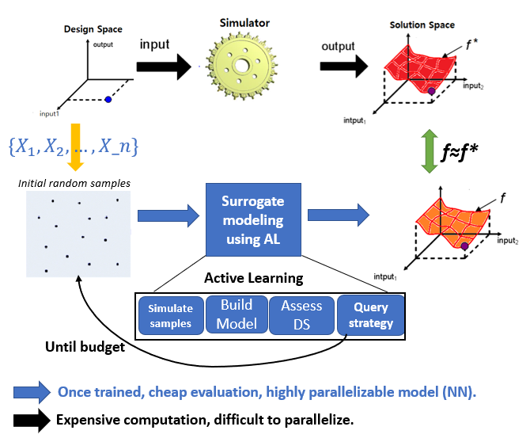
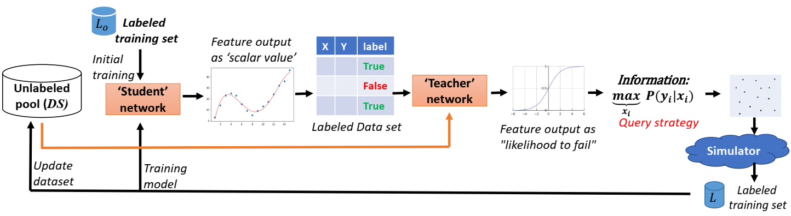
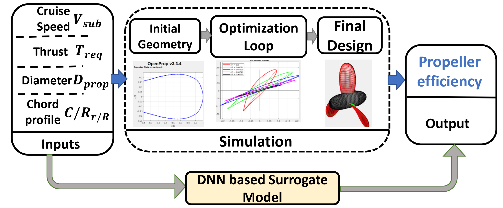
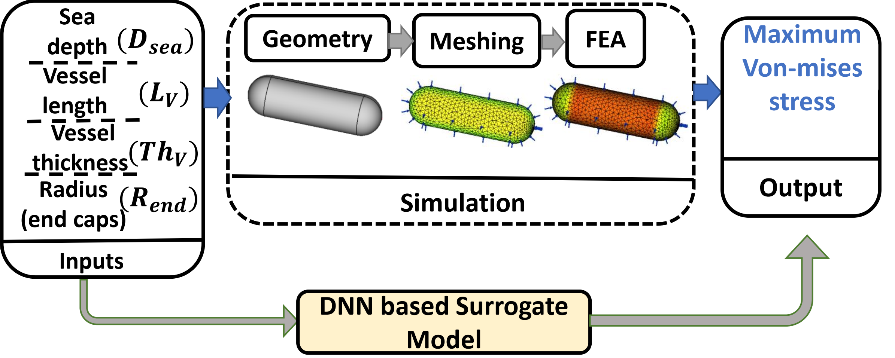

# Strategic Sampling from design space for Deep Learning based surrogate models
This folder consist of codes and results of experimentation towards AI based strategic sampling strategy for Deep Learning based surrogate model. General approach of strategic sampling has long history and this heuristic based field of research is called 'Active learning'. The general approach of active learning and motivation is below.

### General Active Learning pipe line and motivation
The main motivation of surrogate modeling is fast mathematical approximations of long running numerical codes. Since these simulations are computationally very costly, we want to learn the surrogate with minimum number of samples or take strategic sampling.
Classical approach of active learning based surrogate modeling relies on Kriging / GP based models (refer [Engineering Design via Surrogate Modeling](https://onlinelibrary.wiley.com/doi/book/10.1002/9780470770801)). With their limitation and discovery of deep learning which are universal function approximator, it is beneficial to use Deep Neural network as a surrogate model. However doing active learning on DNN model out of Bayesian framework is not well studied.

### Deep Active Learning for regression:
In this work, we attempted to desing Deep Active learning strategy out of Bayesian framework. The general pipeline is shown below, which consist of two netwoeks. The student network tried to learn the surrogate behavior however teacher nework tries to guide next iteration's sampling process to location where student network has poor performance.

### Use cases:
For empirical evalution,we selected two different engineering design doamins:
 - #### Propeller Design Surrogate:

   
 - #### FEA based static stress prediction surrogate
   

### Data :
The dataset can be downloaded from here:

### Directory and codes:
 - Propeller_design: The directory consist of code, simulation results and  output figures. Major files:
   - OpenProp_eval.m : This is edited open prop matlab simulation code to run openprop with python for data generation. Replace this code in openprop source code directory, which will add capability to run openprop numerical simulation with python.

  -  pool_data_generation.py: python script for connecting to Matlab and generation of  data.  
  - main.py : starting point of training process and control all hyper parameters for experimentation. User need to tweak only these file , along with student and teacher network architecture- student_model.py : student regression network, teacher_model.py : teacher network architecture.
  - All other scipts assist in the whole learning process.
  - random_tester.py : script of training student network based on Monte Carlo samples.

- Submarine_hull_stress_design: The directory consist of code, simulation results and  output figures. Major files:
   - main.py : starting point of training process and control all hyper parameters for experimentation. User need to tweak only these file , along with student and teacher network architecture- student_model.py : student regression network, teacher_model.py : teacher network architecture.
   - All other scipts assist in the whole learning process.
   - random_tester.py : script of training student network based on Monte Carlo samples.

   - For data generation, we used open-source CAD tool called 'FreeCAD' with parametric CAD seed design- interfaced with python script to automate data generation process. (source code will be released soon)

### Dependencies :
The source code is written in pytorch and tested on Ubuntu 21.04 hirsute. Apart form python packages , we used open-source numerical simulation tool mentioned below:   
 - OpenProp - propeller simulation tool,OpenProp is a suite of open-sourced propeller and turbine design codes written in the MATLAB R programming language . The codes are based on the same lifting line propeller
design theory utilized in codes employed by the US Navy for preliminary parametric design of marine propellers. click [here](https://openprop.engineering.dartmouth.edu/) to read about it and download.

 - FreeCAD : Open soruce CAD modeling tool, click [here](https://www.freecadweb.org/) to read about it and download.
