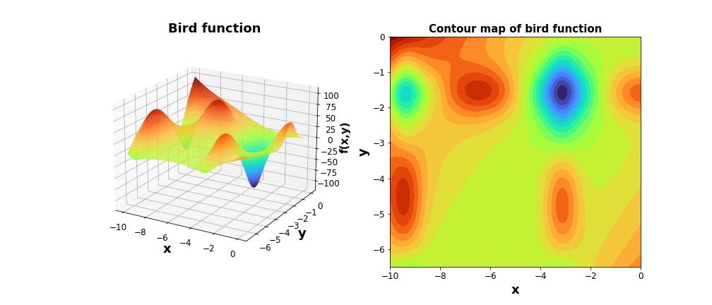

# DeepAL using epsilon-HQS

In this work, we propose a new approach of Active Learning (AL) for regression problem. This framework of AL is ensemble-free and work in batch setting. We empirically evaluted this approach in different probelms as well as complex engineering design domains: finite element analysis (FEA) , computational fluid dynamics (CFD) and propeller design. In all these engineering domains, data generation is very costly and by using our AL framework , we were able to get same accuracy of surrogate as other baselines but up to 40\% more sample efficient. It saves data generation time in days in these complex domains.  

Full details can be found in the arXiv paper "Data efficient surrogate modeling for engineering design: Ensemble-free batch mode deep active learning for regression": https://arxiv.org/abs/2211.10360.

Authors: Harsh Vardhan, Umesh Timalsina, Peter Volgyesi, Janos Sztipanovits

If you like our work and want to cite:

<a id="1">[1]</a> 
@article{vardhan2022data,
  title={Data efficient surrogate modeling for engineering design: Ensemble-free batch mode deep active learning for regression},
  author={Vardhan, Harsh and Timalsina, Umesh and Volgyesi, Peter and Sztipanovits, Janos},
  journal={arXiv preprint arXiv:2211.10360},
  year={2022}
}

## Deep AL using student-teacher fashion- A glance :
The research motivation was to device a strategy of Deep Active learning for regression problem that is simple and easy to scale and doenot need ensembling or Bayesian Neural network. The general pipeline of our is shown below, that consist of two neural networks. The goal of student network is to learn the surrogate behavior (regression modeling), and the goal of teacher nework is to guide sampling process in next iteration's ideally to regions in design space where student network has poorer prediction capability. To, this end we tested it in pool-based scheme.

## An intutive explanation of this process using 2D bird function: 
 $$f(x, y) = sin(x)e^{(1-cos(y))^2}+cos(y)e^{(1-sin(x))^2}+(x-y)^2\\
 -10\leq x\leq0 \;; -6.5 \leq y \leq 0 $$

### Evolution of student and teacher network at end of different Active Learning iterations
At each row : Left image shows ground truth about student network in the design space (shows prediction performance of student on mesh grid data - ${\color{red}red}$: fail to predict within acceptable accuracy, ${\color{blue}Blue}$: able to predict within acceptable accuracy) and on right image, similar is estimated by the teacher network.  

It can be observed that teacher network can estimate the performance of student network at end of each iteration at very good correspondence.  

# Strategic Sampling from design space for Deep Learning based surrogate model s
This folder consist of codes and results of experimentation towards AI based strategic sampling strategy for Deep Learning based surrogate model. General approach of strategic sampling has long history and this heuristic based field of research is called 'Active learning'. The general approach of active learning and motivation is below.

### General Active Learning pipe line and motivation
The main motivation of surrogate modeling is fast mathematical approximations of long running numerical codes. Since these simulations are computationally very costly, we want to learn the surrogate with minimum number of samples or take strategic sampling.
Classical approach of active learning based surrogate modeling relies on Kriging / GP based models (refer [Engineering Design via Surrogate Modeling](https://onlinelibrary.wiley.com/doi/book/10.1002/9780470770801)). With their limitation and discovery of deep learning which are universal function approximator, it is beneficial to use Deep Neural network as a surrogate model. However doing active learning on DNN model out of Bayesian framework is not well studied.

### Use cases:
For empirical evalution,we selected two different engineering design doamins:
 - #### Propeller Design Surrogate:

   
 - #### FEA based static stress prediction surrogate
   
 - #### UUV hull drag estimation surrogate 

### Data and Trained models:
The dataset and trained models can be downloaded from [here](https://drive.google.com/drive/folders/1rYjyHzgEVD3UibIQh1WbA4lPq7Ae1av2?usp=sharing).

## Miscelleneous
### Directory and codes:
 - Propeller_design: The directory consist of code, simulation results and  output figures. Major files:
   - OpenProp_eval.m : This is edited open prop matlab simulation code to run openprop with python for data generation. Replace this code in openprop source code directory, which will add capability to run openprop numerical simulation with python.

  -  pool_data_generation.py: python script for connecting to Matlab and generation of  data.  
  - main.py : starting point of training process and control all hyper parameters for experimentation. User need to tweak only these file , along with student and teacher network architecture- student_model.py : student regression network, teacher_model.py : teacher network architecture.
  - All other scipts assist in the whole learning process.
  - random_tester.py : script of training student network based on Monte Carlo samples.

- Submarine_hull_stress_design: The directory consist of code, simulation results and  output figures. Major files:
   - main.py : starting point of training process and control all hyper parameters for experimentation. User need to tweak only these file , along with student and teacher network architecture- student_model.py : student regression network, teacher_model.py : teacher network architecture.
   - All other scipts assist in the whole learning process.
   - random_tester.py : script of training student network based on Monte Carlo samples.

   - For data generation, we used open-source CAD tool called 'FreeCAD' with parametric CAD seed design- interfaced with python script to automate data generation process. (source code will be released soon)

### Dependencies :
The source code is written in pytorch and tested on Ubuntu 21.04 hirsute. Apart form python packages , we used open-source numerical simulation tool mentioned below:   
 - OpenProp - OpenProp is a suite of open-sourced propeller and turbine design codes written in the MATLAB programming language . The codes are based on the same lifting line propeller design theory utilized in codes employed by the US Navy for preliminary parametric design of marine propellers. click [here](https://openprop.engineering.dartmouth.edu/) to read more about it and download the software.

 - FreeCAD : Open source CAD modeling tool, click [here](https://www.freecadweb.org/) to read about it and download.

 - Data collected from other open source works 

## Summary

Based on this framework, you should be able to train deep learning surrogate with better sample efficiency. In addition, the can be extended to any deep learning based regression problem like image data based regression, multi output regression. 

We are actively testing this approach on different data set. Let us know if things don't work for you, or if you want help :) ! The authors